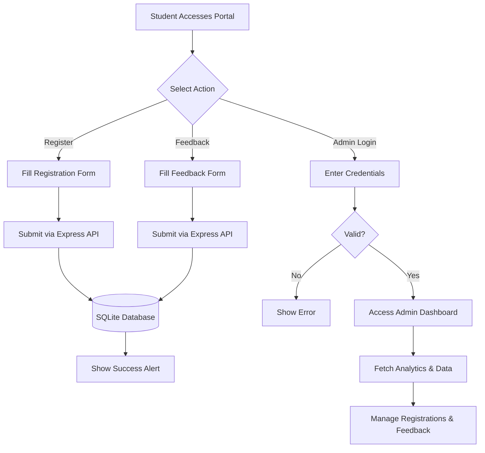
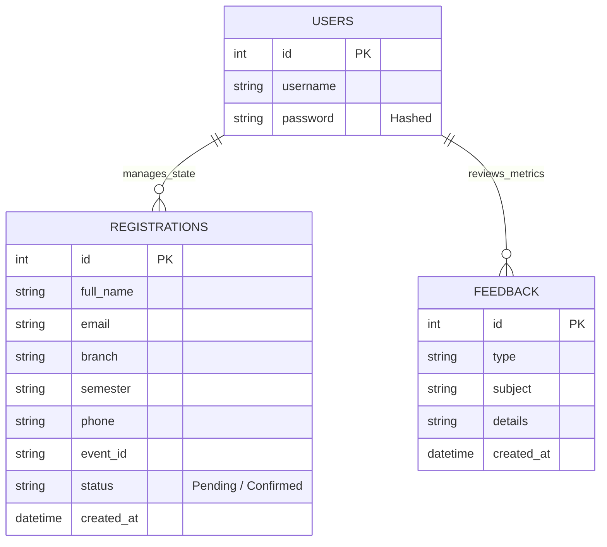

<div style="display: flex; flex-direction: column; align-items: center; justify-content: center; min-height: 90vh; text-align: center; font-family: sans-serif; background-color: white; color: black;">
    <h1 style="font-size: 48px; margin-bottom: 20px; color: #000000; font-weight: bold;">College Event Portal</h1>
    <h2 style="font-size: 32px; color: #000000; margin-bottom: 80px;">(EventHub)</h2>
    <h3 style="font-size: 24px; font-weight: bold; color: #000000; margin-bottom: 20px;">A Minor Project Report</h3>
    <p style="font-size: 18px; color: #333333; max-width: 600px;">Submitted in partial fulfillment of the requirements for the successful completion of the academic program.</p>
    <div style="margin-top: 120px; font-size: 22px; color: #000000;">
        <p style="margin-bottom: 10px;"><strong>Submitted by:</strong></p>
        <p>Student Name</p>
        <p style="font-size: 18px; color: #333333;">(Registration Number)</p>
    </div>
</div>

<div class="page-break"></div>

## 1. Abstract
The "College Event Portal" (EventHub) is a comprehensive web-based application designed to streamline the administration and registration processes for college-level events, technical fests, and workshops. With the increasing number of student activities, manual registration and physical record-keeping have become inefficient and error-prone. This project presents a centralized, digital platform where students can seamlessly browse event details, register for competitions (e.g., Hackathons, RoboWars), and submit feedback. Concurrently, administrators are provided with a secure, authenticated dashboard to track real-time registration statistics, manage pending approvals, and view user feedback. The system is built using a modern technology stack comprising a responsive Vanilla HTML/CSS/JS frontend featuring glassmorphism design principles, and a robust Node.js/Express backend integrated with an SQLite relational database.

This project significantly reduces administrative overhead by eliminating paper-based forms and redundant data entry workflows. It ensures high data integrity, dynamic UI updates without page reloads (SPA behavior), and strict access control mechanisms using bcrypt password hashing algorithms. Ultimately, EventHub serves as a scalable foundation that educational institutions can deploy to effectively modernize their extracurricular event management.

<div class="page-break"></div>

## 2. Introduction
In modern educational institutions, organizing technical and cultural events requires immense coordination between multiple departments, student chapters, and faculty groups. Traditional methods of event management often involve rudimentary setups such as Google Forms, physical paper registrations, or fragmented Excel spreadsheets. These methods inherently lead to disjointed data, delayed communication, administrative bottlenecks, and significant margin for human error during data collation.

The College Event Portal aims to solve these pervasive challenges by providing a dedicated, fully-automated software application. The primary objectives of this project are:
- **Optimization of Workflows:** To provide a visually appealing, responsive, and highly user-friendly interface for students to register for events instantly from any device.
- **Data Centralization:** To eliminate manual data entry and reduce administrative overhead by consolidating all applicant data into a single, structured SQL database.
- **Real-Time Monitoring:** To offer an exclusive, authenticated Administrator Dashboard for real-time monitoring of registration counts, attendee pending statuses, and granular student feedback analytics.
- **Security & Privacy:** To handle student data securely using modern backend architecture (Node.js) and industry-standard password hashing (Bcrypt) for administrative access.

By addressing the root causes of event management inefficiencies, this system acts as a reliable intermediary between the student body and college administration.

<div class="page-break"></div>

## 3. System (Existing + Proposed)

### Existing System
The existing system for managing college events typically relies on disparate tools such as physical form submissions, manual Excel spreadsheets, and isolated email chains. When a student registers, their data is often manually transcribed by coordinators, which introduces high latency.
**Drawbacks of the Existing System:**
- **Data Redundancy:** Multiple copies of the same student details across different departments and databases.
- **Time-Consuming:** Manual verification of student branches, semesters, and contact details is required.
- **Lack of Transparency:** Students cannot easily confirm their registration status, and administrators lack a real-time, birds-eye overview of overall event capacities.
- **Poor Feedback Loop:** Collecting post-event feedback is tedious and the data is rarely evaluated effectively due to poor structuring.

### Proposed System
The proposed "EventHub" system digitizes the entire lifecycle of event registration natively in a single, cohesive web application. It acts as a modern Single Page Application (SPA) on the client side, interfacing with a centralized REST API on the server side.
**Advantages of the Proposed System:**
- **Centralized Database:** All registrations, users, and feedback are securely stored in a centralized SQLite database, ensuring ACID compliance and instant data retrieval.
- **Real-time Analytics:** The Admin Dashboard automatically calculates total registrations, pending reviews, and total feedback received dynamically.
- **Secure Access Control:** The backend enforces session-based authentication to ensure only authorized personnel can view or modify registration data.
- **Modern UI/UX:** The application utilizes a dynamic Glassmorphism aesthetic, ensuring high user engagement and exceptional mobile responsiveness without horizontal scrolling issues.

<div class="page-break"></div>

## 4. Software Requirements Specification (SRS)

### 4.1 Functional Requirements
- **User Registration Module:** Students must be able to securely submit their personal details (Name, Email, Branch, Semester, Phone) to register for specific events (e.g. Hackathon, RoboWar).
- **Feedback Mechanism:** Users must be able to submit qualitative and quantitative data (opinions, complaints, or technical issues) through a dedicated feedback form.
- **Admin Authentication:** Administrators must be able to log in using a secure username and password to gain an HTTP session.
- **Dashboard Analytics:** The system must conditionally render aggregated statistics (Total Registrations, Pending Reviews, Total Feedbacks) visible only to logged-in administrators.
- **Data Management Capabilities:** Administrators must have the active ability to toggle the status of a registration (Pending/Confirmed) and permanently delete malicious or invalid entries via the dashboard UI.

### 4.2 Non-Functional Requirements
- **Performance:** The platform must load efficiently. The backend API requests must be processed within 50-100 milliseconds utilizing the Node.js asynchronous event-driven architecture.
- **Security:** Administrator passwords must be hashed using a salt round of 10 via `bcrypt` before database storage. API routes must be protected against malicious payloads, and protected routes must categorically reject unauthenticated session cookies.
- **Usability:** The interface must be intuitively navigable. It must achieve 100% responsiveness, ensuring accessibility across desktop monitors, tablets, and mobile devices by dynamically shifting from CSS Grid to Flexbox column wraps.
- **Maintainability:** The codebase must be highly modular, separating concerns between DOM manipulation (frontend), routing (Express), and schema definitions (SQLite).

<div class="page-break"></div>

## 5. Design

### 5.1 Flowchart



<div class="page-break"></div>

### 5.2 Entity-Relationship (ER) Diagram



<div class="page-break"></div>

## 6. Output Screenshots

### 6.1 Admin Dashboard Overview
Displays real-time pending approvals and total registration metrics.

<div class="screenshot-box">Screenshot: Admin Dashboard overview</div>

<div class="page-break"></div>

### 6.2 Event Registration Form
Displays the primary student-facing form utilizing modern glassmorphism aesthetics.

<div class="screenshot-box">Screenshot: Responsive Registration Form</div>

<div class="page-break"></div>

### 6.3 Admin Security Modal
Presents the secure Authentication challenge when accessing protected dashboard boundaries.

<div class="screenshot-box">Screenshot: Admin Login Modal</div>

<div class="page-break"></div>

### 6.4 Venue and Contact System
Provides physical logistics and coordinates for the event footprint.

<div class="screenshot-box">Screenshot: Complete Contact Page</div>

<div class="page-break"></div>

### 6.5 Feedback Intake Loop
Highlights the digital collection form for abstract user metrics post-event.

<div class="screenshot-box">Screenshot: Dynamic Feedback System</div>

<div class="page-break"></div>

## 7. Conclusion
The College Event Portal (EventHub) successfully fulfills all initial requirements by delivering a fast, responsive, and highly secure platform for managing institutional events. By migrating from rudimentary manual processes to a fully automated Node.js and SQLite architecture, the system guarantees data integrity, rapid data retrieval, and streamlined administrative workflows. 

The modular codebase enables the institution to completely bypass older legacy systems (such as local XAMPP and PHP instances) in favor of portable modern microservices. Furthermore, this approach allows for future vertical and horizontal scalability, enabling stakeholders to easily add features such as automated email confirmations, SMS gateways, payment integration structures, and comprehensive CSV export systems. EventHub effectively acts as the vanguard for modern, paperless college administration.

<div class="page-break"></div>

***
*Begin Appendix.* 

## 8. Complete Source Code Appendices

### Appendix A: index.html
```html
<!DOCTYPE html>
<html lang="en">

<head>
    <meta charset="UTF-8">
    <meta name="viewport" content="width=device-width, initial-scale=1.0">
    <title>College Event Portal</title>

    <!-- Fonts -->
    <link rel="preconnect" href="https://fonts.googleapis.com">
    <link rel="preconnect" href="https://fonts.gstatic.com" crossorigin>
    <link
        href="https://fonts.googleapis.com/css2?family=Inter:wght@400;500;600&family=Poppins:wght@500;600;700&display=swap"
        rel="stylesheet">

    <!-- Icons (Phosphor Icons) -->
    <script src="https://unpkg.com/@phosphor-icons/web"></script>

    <!-- Styles -->
    <link rel="stylesheet" href="style.css?v=2.0">
</head>

<body>

    <div class="app-container">
        <!-- Sidebar Navigation -->
        <nav class="sidebar glass-panel">
            <div class="logo">
                <i class="ph-fill ph-graduation-cap"></i>
                <span>Event<span class="highlight">Hub</span></span>
            </div>

            <!-- Mobile Reload Button -->
            <button id="reload-btn" class="icon-btn reload-trigger" onclick="location.reload()" title="Reload App">
                <i class="ph-bold ph-arrow-clockwise"></i>
            </button>

            <ul class="nav-links">
                <li class="active" data-target="registration">
                    <i class="ph ph-ticket"></i>
                    <span>Register</span>
                </li>
                <li data-target="admin">
                    <i class="ph ph-squares-four"></i>
                    <span>Admin Dashboard</span>
                </li>
                <li data-target="contact">
                    <i class="ph ph-map-pin"></i>
                    <span>Venue & Contact</span>
                </li>
                <li data-target="feedback">
                    <i class="ph ph-chat-text"></i>
                    <span>Feedback</span>
                </li>
            </ul>

            <div class="user-profile">
                <div class="avatar">JS</div>
                <div class="info">
                    <span class="name">Jithin Student</span>
                    <span class="role">Developer</span>
                </div>
            </div>
        </nav>

        <!-- Main Content Area -->
        <main class="main-content">

            <!-- PAGE: REGISTRATION -->
            <section id="registration" class="page active">
                <header class="page-header">
                    <h1>Event Registration</h1>
                    <p>Join the biggest tech fest of the year.</p>
                </header>

                <div class="content-grid two-columns">
                    <div class="glass-card hero-card">
                        <div class="badge">coming soon !</div>
                        <!-- <h2>Innovate & Inspire</h2> -->
                        <!-- <p>Showcase your skills in coding, design, and robotics. Compete with the best minds across the -->
                            <!-- country.</p> -->

                        <!-- <div class="event-details"> 
                            <div class="detail-item">
                                <i class="ph ph-calendar-blank"></i>
                                <span>March 15-18, 2026</span>
                            </div>
                            <div class="detail-item">
                                <i class="ph ph-clock"></i>
                                <span>10:00 AM Onwards</span>
                            </div>
                        </div>
                   </div> -->

                    <form id="registrationForm" class="glass-card registration-form">
                        <h3>Sign Up Now</h3>

                        <div class="input-group">
                            <label>Full Name</label>
                            <input type="text" name="fullName" placeholder="e.g. Alex Doe" required>
                        </div>

                        <div class="input-group">
                            <label>Email Address</label>
                            <input type="email" name="email" placeholder="alex@college.edu" required>
                        </div>

                        <div class="input-group">
                            <label>Branch</label>
                            <select name="branch" required>
                                <option value="" disabled selected>Select Branch</option>
                                <option value="Mechanical Engineering">Mechanical Engineering</option>
                                <option value="Electrical and Communication Engineering">Electrical and Communication
                                    Engineering</option>
                                <option value="Computer Hardware Engineering">Computer Hardware Engineering</option>
                            </select>
                        </div>

                        <div class="input-group">
                            <label>Semester</label>
                            <select name="semester" required>
                                <option value="" disabled selected>Select Semester</option>
                                <option value="1">Semester 1</option>
                                <option value="2">Semester 2</option>
                                <option value="3">Semester 3</option>
                                <option value="4">Semester 4</option>
                                <option value="5">Semester 5</option>
                                <option value="6">Semester 6</option>
                            </select>
                        </div>

                        <div class="input-group">
                            <label>Phone Number</label>
                            <input type="tel" name="phone" placeholder="+1 (555) 000-0000" pattern="[0-9\+\-\s]{10,}" required>
                        </div>

                        <div class="input-group">
                            <label>Select Event</label>
                            <select name="event">
                                <option value="Hackathon">Hackathon</option>
                                <option value="RoboWar">RoboWar</option>
                                <option value="UI/UX Design">UI/UX Design</option>
                            </select>
                        </div>

                        <button type="submit" class="btn-primary">
                            Register <i class="ph-bold ph-arrow-right"></i>
                        </button>
                    </form>
                </div>
            </section>


            <!-- PAGE: ADMIN DASHBOARD -->
            <section id="admin" class="page">
                <header class="page-header">
                    <h1>Dashboard</h1>
                    <p>Manage registrations and event logistics.</p>
                </header>

                <div class="stats-row">
                    <div class="glass-card stat-card">
                        <span class="label">Total Registrations</span>
                        <div class="value" id="stat-total-reg">0</div>
                    </div>
                    <div class="glass-card stat-card">
                        <span class="label">Pending Review</span>
                        <div class="value" id="stat-pending-rev">0</div>
                    </div>
                    <div class="glass-card stat-card">
                        <span class="label">Total Feedback</span>
                        <div class="value" id="stat-total-feedback">0</div>
                    </div>
                </div>

                <div class="dashboard-split">
                    <div class="glass-card table-container" style="margin-bottom: 2rem;">
                        <div class="table-header">
                            <h3>Recent Registrations</h3>
                            <button class="btn-sm" id="logout-btn">Logout</button>
                        </div>
                        <table>
                            <thead>
                                <tr>
                                    <th>Name</th>
                                    <th>Event</th>
                                    <th>Date</th>
                                    <th>Status</th>
                                    <th>Action</th>
                                </tr>
                            </thead>
                            <tbody>
                                <tr>
                                    <td>Michael Scott</td>
                                    <td>Hackathon</td>
                                    <td>Oct 24</td>
                                    <td><span class="tag success">Confirmed</span></td>
                                    <td><button class="icon-btn"><i class="ph ph-trash"></i></button></td>
                                </tr>
                                <tr>
                                    <td>Dwight Schrute</td>
                                    <td>RoboWar</td>
                                    <td>Oct 24</td>
                                    <td><span class="tag pending">Pending</span></td>
                                    <td><button class="icon-btn"><i class="ph ph-trash"></i></button></td>
                                </tr>
                                <tr>
                                    <td>Jim Halpert</td>
                                    <td>UI Design</td>
                                    <td>Oct 23</td>
                                    <td><span class="tag success">Confirmed</span></td>
                                    <td><button class="icon-btn"><i class="ph ph-trash"></i></button></td>
                                </tr>
                            </tbody>
                        </table>
                    </div>

                    <div class="glass-card" style="margin-bottom: 2rem;">
                        <div class="table-header">
                            <h3>Recent Feedback</h3>
                        </div>
                        <div id="feedback-list" style="max-height: 400px; overflow-y: auto;">
                            <p style="padding: 1rem; color: var(--text-muted);">Loading feedback...</p>
                        </div>
                    </div>
                </div>
            </section>


            <!-- PAGE: VENUE & CONTACT -->
            <section id="contact" class="page">
                <header class="page-header">
                    <h1>Venue & Contact</h1>
                    <p>Get in touch or find your way.</p>
                </header>

                <div class="contact-grid">
                    <div class="glass-card contact-card">
                        <div class="icon-circle"><i class="ph-fill ph-map-pin"></i></div>
                        <h3>Location</h3>
                        <p>Govt.polytechnic,Ezhukone<br>Auditorium</p>
                    </div>

                    <div class="glass-card contact-card">
                        <div class="icon-circle"><i class="ph-fill ph-phone"></i></div>
                        <h3>Phone</h3>
                        <p>Meet Office<br>Mon-Fri, 9am - 5pm</p>
                    </div>

                    <div class="glass-card contact-card">
                        <div class="icon-circle"><i class="ph-fill ph-envelope"></i></div>
                        <h3>Email</h3>
                        <p>gptc@ezhukone.edu<br>support@gptc.edu</p>
                    </div>
                </div>

                <div class="glass-card map-placeholder">
                    <span>Interactive Map Widget</span>
                </div>
            </section>

            <!-- PAGE: FEEDBACK -->
            <section id="feedback" class="page">
                <header class="page-header">
                    <h1>Feedback & Support</h1>
                    <p>Let us know what you think or report an issue.</p>
                </header>

                <div class="glass-card" style="max-width: 600px; margin: 0 auto;">
                    <form id="feedbackForm">
                        <h3 style="margin-bottom: 24px;">Submit Feedback</h3>

                        <div class="input-group">
                            <label>Feedback Type</label>
                            <select name="feedbackType" required>
                                <option value="Opinion">Opinion / Suggestion</option>
                                <option value="Complaint">Complaint</option>
                                <option value="Issue">Technical Issue</option>
                                <option value="Other">Other</option>
                            </select>
                        </div>

                        <div class="input-group">
                            <label>Subject</label>
                            <input type="text" name="subject" placeholder="Brief summary" required>
                        </div>

                        <div class="input-group">
                            <label>Details</label>
                            <textarea name="details" placeholder="Describe your feedback here..." rows="5"
                                style="width: 100%; padding: 12px; border-radius: 12px; border: 1px solid rgba(0,0,0,0.1); background: rgba(255,255,255,0.5); outline: none;"
                                required></textarea>
                        </div>

                        <button type="submit" class="btn-primary">
                            Submit Feedback <i class="ph-bold ph-paper-plane-right"></i>
                        </button>
                    </form>
                </div>
            </section>

        </main>
    </div>

    <!-- LOGIN MODAL -->
    <div id="login-modal" class="modal-overlay">
        <div class="glass-card login-card">
            <div class="modal-header">
                <h2>Admin Access</h2>
                <p>Please enter your credentials.</p>
            </div>
            <form id="login-form">
                <div class="input-group">
                    <label>Username</label>
                    <input type="text" id="username" placeholder="admin" required>
                </div>
                <div class="input-group">
                    <label>Password</label>
                    <input type="password" id="password" placeholder="••••••" required>
                </div>
                <p id="login-error" class="error-msg"></p>
                <div class="modal-actions">
                    <button type="button" class="btn-text" id="close-login">Cancel</button>
                    <button type="submit" class="btn-primary">Login</button>
                </div>
            </form>
        </div>
    </div>

    <script src="script.js?v=2.0"></script>
</body>

</html>

```
<br>

### Appendix B: style.css
```css
/* CSS Variables & Theme */
:root {
    /* Colors */
    --primary: #6366f1;
    --primary-hover: #4f46e5;
    --bg-gradient: linear-gradient(135deg, #fdfbfb 0%, #ebedee 100%);
    --bg-mesh: radial-gradient(at 0% 0%, hsla(253, 16%, 7%, 1) 0, transparent 50%),
        radial-gradient(at 50% 0%, hsla(225, 39%, 30%, 1) 0, transparent 50%),
        radial-gradient(at 100% 0%, hsla(339, 49%, 30%, 1) 0, transparent 50%);

    /* Modern Light/Soft Theme - Glassmorphism base */
    --glass-bg: rgba(255, 255, 255, 0.7);
    --glass-border: rgba(255, 255, 255, 0.5);
    --glass-shadow: 0 8px 32px 0 rgba(31, 38, 135, 0.07);

    --text-main: #1e293b;
    --text-muted: #64748b;
    --white: #ffffff;
}

/* Reset & Base */
* {
    margin: 0;
    padding: 0;
    box-sizing: border-box;
    font-family: 'Inter', sans-serif;
}

body {
    background: #eef2f6;
    background-image:
        radial-gradient(at 40% 20%, hsla(266, 50%, 90%, 1) 0px, transparent 50%),
        radial-gradient(at 80% 0%, hsla(189, 100%, 90%, 1) 0px, transparent 50%),
        radial-gradient(at 0% 50%, hsla(340, 100%, 96%, 1) 0px, transparent 50%);
    background-attachment: fixed;
    color: var(--text-main);
    height: 100vh;
    overflow: hidden;
    /* App-like feel */
}

h1,
h2,
h3 {
    font-family: 'Poppins', sans-serif;
    font-weight: 600;
}

/* Layout */
.app-container {
    display: flex;
    height: 100vh;
    padding: 20px;
    gap: 20px;
}

/* Sidebar */
.sidebar {
    width: 260px;
    border-radius: 24px;
    display: flex;
    flex-direction: column;
    padding: 24px;
    /* Glass styles applied via utility class */
}

.logo {
    display: flex;
    align-items: center;
    gap: 12px;
    font-size: 1.5rem;
    font-weight: 700;
    margin-bottom: 40px;
    color: var(--primary);
}

.reload-trigger {
    display: none;
    /* Hidden by default on desktop, or show if desired */
}

.nav-links {
    list-style: none;
    flex: 1;
}

.nav-links li {
    display: flex;
    align-items: center;
    gap: 12px;
    padding: 12px 16px;
    border-radius: 12px;
    cursor: pointer;
    transition: all 0.3s ease;
    color: var(--text-muted);
    margin-bottom: 8px;
    font-weight: 500;
}

.nav-links li:hover {
    background: rgba(255, 255, 255, 0.5);
    color: var(--primary);
}

.nav-links li.active {
    background: var(--white);
    color: var(--primary);
    box-shadow: 0 4px 12px rgba(99, 102, 241, 0.15);
}

.nav-links li i {
    font-size: 1.2rem;
}

.user-profile {
    display: flex;
    align-items: center;
    gap: 12px;
    padding-top: 20px;
    border-top: 1px solid rgba(0, 0, 0, 0.05);
}

.avatar {
    width: 40px;
    height: 40px;
    border-radius: 50%;
    background: linear-gradient(135deg, #6366f1, #a855f7);
    color: white;
    display: flex;
    align-items: center;
    justify-content: center;
    font-weight: 600;
    font-size: 0.9rem;
}

.user-profile .info {
    display: flex;
    flex-direction: column;
}

.user-profile .name {
    font-weight: 600;
    font-size: 0.9rem;
}

.user-profile .role {
    font-size: 0.75rem;
    color: var(--text-muted);
}

/* Main Content */
.main-content {
    flex: 1;
    position: relative;
    overflow: hidden;
    /* Internal scroll */
}

.page {
    /* Absolute positioning for transitions or display:none toggling */
    display: none;
    height: 100%;
    flex-direction: column;
    overflow-y: auto;
    padding-right: 8px;
    /* Room for scrollbar */
    animation: fadeIn 0.4s ease;
}

.page.active {
    display: flex;
}

@keyframes fadeIn {
    from {
        opacity: 0;
        transform: translateY(10px);
    }

    to {
        opacity: 1;
        transform: translateY(0);
    }
}

.page-header {
    margin-bottom: 32px;
}

.page-header h1 {
    font-size: 2rem;
    margin-bottom: 8px;
}

.page-header p {
    color: var(--text-muted);
}

/* Components & Utilities */
.glass-panel,
.glass-card {
    background: var(--glass-bg);
    backdrop-filter: blur(16px);
    -webkit-backdrop-filter: blur(16px);
    border: 1px solid var(--glass-border);
    box-shadow: var(--glass-shadow);
}

.glass-card {
    border-radius: 24px;
    padding: 24px;
}

.btn-primary {
    background: var(--primary);
    color: white;
    border: none;
    padding: 12px 24px;
    border-radius: 12px;
    font-weight: 600;
    cursor: pointer;
    display: inline-flex;
    align-items: center;
    gap: 8px;
    transition: transform 0.2s;
}

.btn-primary:hover {
    background: var(--primary-hover);
    transform: translateY(-2px);
    box-shadow: 0 4px 12px rgba(79, 70, 229, 0.3);
}

/* Registration Page Styling */
.content-grid {
    display: grid;
    gap: 24px;
}

.two-columns {
    grid-template-columns: 1fr 1fr;
    align-items: start;
}

.hero-card {
    background: linear-gradient(135deg, rgba(255, 255, 255, 0.8), rgba(255, 255, 255, 0.4));
}

.hero-card .badge {
    display: inline-block;
    padding: 4px 12px;
    background: #e0e7ff;
    color: #4338ca;
    border-radius: 20px;
    font-size: 0.8rem;
    font-weight: 600;
    margin-bottom: 16px;
}

.hero-card h2 {
    font-size: 2.5rem;
    margin-bottom: 16px;
    line-height: 1.2;
}

.event-details {
    margin-top: 32px;
    display: flex;
    gap: 24px;
}

.detail-item {
    display: flex;
    align-items: center;
    gap: 8px;
    color: var(--text-muted);
    font-weight: 500;
}

.registration-form h3 {
    margin-bottom: 24px;
}

.input-group {
    margin-bottom: 20px;
}

.input-group label {
    display: block;
    margin-bottom: 8px;
    font-size: 0.9rem;
    font-weight: 500;
    color: var(--text-muted);
}

.input-group input,
.input-group select,
.input-group textarea {
    width: 100%;
    padding: 12px 16px;
    border-radius: 12px;
    border: 1px solid rgba(0, 0, 0, 0.1);
    background: rgba(255, 255, 255, 0.5);
    font-size: 1rem;
    outline: none;
    transition: all 0.2s;
}

.input-group input:focus,
.input-group select:focus,
.input-group textarea:focus {
    border-color: var(--primary);
    background: white;
    box-shadow: 0 0 0 3px rgba(99, 102, 241, 0.1);
}

/* Judges & Winners */
.split-view {
    display: flex;
    gap: 32px;
    height: 100%;
}

.column {
    flex: 1;
}

.section-title {
    font-size: 1.25rem;
    margin-bottom: 24px;
    display: flex;
    align-items: center;
    gap: 10px;
    color: var(--text-main);
}

.card-stack {
    display: flex;
    flex-direction: column;
    gap: 16px;
}

.person-card {
    display: flex;
    align-items: center;
    gap: 16px;
    padding: 16px;
    transition: transform 0.2s;
}

.person-card:hover {
    transform: translateX(10px);
    background: rgba(255, 255, 255, 0.9);
}

.img-placeholder {
    width: 60px;
    height: 60px;
    border-radius: 16px;
}

.gradient-1 {
    background: linear-gradient(45deg, #ff9a9e, #fad0c4);
}

.gradient-2 {
    background: linear-gradient(45deg, #a18cd1, #fbc2eb);
}

.gradient-3 {
    background: linear-gradient(45deg, #84fab0, #8fd3f4);
}

.winner-card {
    text-align: center;
    position: relative;
    border: 2px solid rgba(255, 215, 0, 0.2);
    margin-bottom: 24px;
}

.winner-card .crown-icon {
    font-size: 2rem;
    color: #fbbf24;
    margin-bottom: 8px;
}

.box-shadow-glow {
    box-shadow: 0 20px 40px rgba(251, 191, 36, 0.15);
}

.winner-info h3 {
    margin: 8px 0 4px;
}

.position {
    text-transform: uppercase;
    font-size: 0.75rem;
    letter-spacing: 1px;
    color: #fbbf24;
    font-weight: 700;
}

.prize-tag {
    margin-top: 16px;
    font-weight: 700;
    color: var(--primary);
    font-size: 1.25rem;
}

/* Dashboard */
.stats-row {
    display: grid;
    grid-template-columns: repeat(3, 1fr);
    gap: 20px;
    margin-bottom: 32px;
}

.dashboard-split {
    display: flex;
    flex-direction: column;
    gap: 32px;
}

.stat-card {
    padding: 20px;
}

.stat-card .label {
    font-size: 0.9rem;
    color: var(--text-muted);
    display: block;
    margin-bottom: 8px;
}

.stat-card .value {
    font-size: 2rem;
    font-weight: 700;
    color: var(--text-main);
}

.table-container {
    padding: 0;
    width: 100%;
    overflow-x: auto;
    /* Updated for responsive tables */
    -webkit-overflow-scrolling: touch;
    margin-bottom: 0 !important; /* Override inline margin inside split */
}

.table-header {
    padding: 20px;
    display: flex;
    justify-content: space-between;
    align-items: center;
    border-bottom: 1px solid rgba(0, 0, 0, 0.05);
    min-width: 600px;
    /* Ensure header doesn't squash mainly */
}

table {
    width: 100%;
    border-collapse: collapse;
    min-width: 600px;
    /* Force table width to trigger scroll on small screens */
}

th,
td {
    padding: 16px 20px;
    text-align: left;
}

th {
    font-weight: 600;
    font-size: 0.85rem;
    color: var(--text-muted);
    text-transform: uppercase;
}

td {
    border-bottom: 1px solid rgba(0, 0, 0, 0.03);
    font-size: 0.95rem;
}

.tag {
    padding: 4px 10px;
    border-radius: 20px;
    font-size: 0.75rem;
    font-weight: 600;
}

.tag.success {
    background: #dcfce7;
    color: #15803d;
}

.tag.pending {
    background: #fef9c3;
    color: #a16207;
}

.icon-btn {
    background: none;
    border: none;
    cursor: pointer;
    color: var(--text-muted);
    transition: color 0.2s;
}

.icon-btn:hover {
    color: #ef4444;
}

/* Contact */
.contact-grid {
    display: grid;
    grid-template-columns: repeat(3, 1fr);
    gap: 20px;
    margin-bottom: 32px;
}

.contact-card {
    text-align: center;
    padding: 32px 20px;
}

.icon-circle {
    width: 50px;
    height: 50px;
    background: #e0e7ff;
    color: #4f46e5;
    border-radius: 50%;
    display: flex;
    align-items: center;
    justify-content: center;
    font-size: 1.5rem;
    margin: 0 auto 16px;
}

.map-placeholder {
    height: 200px;
    display: flex;
    align-items: center;
    justify-content: center;
    background: rgba(255, 255, 255, 0.4);
    color: var(--text-muted);
}

/* Responsive */
@media (max-width: 1024px) {

    .two-columns,
    .split-view,
    .dashboard-split {
        flex-direction: column;
    }

    .two-columns,
    .dashboard-split {
        display: flex; /* Override grid */
        grid-template-columns: 1fr;
    }
}

@media (max-width: 768px) {
    body {
        overflow: auto;
        /* Enable global scrolling */
        height: auto;
    }

    .app-container {
        flex-direction: column;
        overflow-y: visible;
        /* Let body handle scroll */
        height: auto;
        padding-bottom: 90px;
        /* More bottom padding for bottom nav */
    }

    .sidebar {
        width: 100%;
        position: sticky;
        top: 0;
        z-index: 100;
        flex-direction: row;
        justify-content: space-between;
        align-items: center;
        padding: 16px 20px;
        border-radius: 0 0 20px 20px;
        margin-bottom: 24px;
        background: rgba(255, 255, 255, 0.85);
        /* More opaque for readability */
    }

    .sidebar .logo {
        margin-bottom: 0;
        font-size: 1.4rem;
    }

    /* Reload Button on Mobile */
    .reload-trigger {
        display: flex;
        align-items: center;
        justify-content: center;
        width: 40px;
        height: 40px;
        border-radius: 50%;
        background: rgba(255, 255, 255, 0.9);
        box-shadow: 0 4px 12px rgba(0, 0, 0, 0.1);
        color: var(--primary);
    }

    /* Bottom Navigation Bar - Docked Mode */
    .nav-links {
        position: fixed;
        bottom: 0;
        left: 0;
        transform: none;
        width: 100%;
        max-width: none;
        background: rgba(255, 255, 255, 0.95);
        backdrop-filter: blur(20px);
        -webkit-backdrop-filter: blur(20px);
        z-index: 1000;
        display: flex;
        justify-content: space-around;
        padding: 12px 0;
        margin: 0;
        box-shadow: 0 -4px 20px rgba(0, 0, 0, 0.05);
        border: none;
        border-top: 1px solid rgba(0, 0, 0, 0.1);
        border-radius: 0;
    }

    .nav-links li {
        flex-direction: column;
        gap: 4px;
        padding: 8px;
        margin: 0;
        border-radius: 8px;
        flex: 1;
        display: flex;
        align-items: center;
        justify-content: center;
    }

    .nav-links li.active {
        background: transparent;
        color: var(--primary);
        box-shadow: none;
    }

    .nav-links li.active i {
        transform: scale(1.2);
        transition: transform 0.2s;
    }

    .nav-links li i {
        font-size: 1.5rem;
    }

    .nav-links li span {
        display: none;
        /* Hide text labels on mobile to prevent overflow */
    }

    .user-profile {
        display: none;
    }

    .main-content {
        padding-bottom: 0;
    }

    /* Space for navbar */
    .contact-grid {
        grid-template-columns: 1fr;
    }

    .stats-row {
        grid-template-columns: 1fr;
    }

    /* Adjust Card Padding for Mobile to ensure content fits */
    .glass-card,
    .login-card,
    .contact-card {
        padding: 20px !important;
    }
}

/* Modal Styles */
.modal-overlay {
    position: fixed;
    top: 0;
    left: 0;
    width: 100%;
    height: 100%;
    background: rgba(0, 0, 0, 0.4);
    backdrop-filter: blur(4px);
    z-index: 2000;
    /* Higher than nav */
    display: none;
    align-items: center;
    justify-content: center;
    opacity: 0;
    transition: opacity 0.3s ease;
}

.modal-overlay.open {
    display: flex;
    opacity: 1;
}

.login-card {
    width: 90%;
    /* Mobile friendly */
    max-width: 400px;
    background: white;
    /* slightly more solid for readability */
    padding: 32px;
    transform: translateY(20px);
    transition: transform 0.3s ease;
    box-shadow: 0 25px 50px -12px rgba(0, 0, 0, 0.25);
}

.modal-overlay.open .login-card {
    transform: translateY(0);
}

.modal-header {
    text-align: center;
    margin-bottom: 24px;
}

.modal-header h2 {
    margin-bottom: 8px;
}

.modal-header p {
    color: var(--text-muted);
    font-size: 0.9rem;
}

.modal-actions {
    display: flex;
    justify-content: flex-end;
    gap: 12px;
    margin-top: 24px;
}

.btn-text {
    background: none;
    border: none;
    padding: 12px 16px;
    cursor: pointer;
    color: var(--text-muted);
    font-weight: 500;
}

.btn-text:hover {
    color: var(--text-main);
}

.error-msg {
    color: #ef4444;
    font-size: 0.85rem;
    margin-top: 8px;
    min-height: 1.2em;
    text-align: center;
}
```
<br>

### Appendix C: script.js
```javascript
// State
let isLoggedIn = false;
let pendingTarget = null;

// DOM Elements
const navItems = document.querySelectorAll('.nav-links li');
const pages = document.querySelectorAll('.page');
const loginModal = document.getElementById('login-modal');
const loginForm = document.getElementById('login-form');
const closeLoginBtn = document.getElementById('close-login');
const loginError = document.getElementById('login-error');

// Navigation Logic
navItems.forEach(item => {
    item.addEventListener('click', () => {
        const targetId = item.getAttribute('data-target');

        // Check Auth for Admin
        if (targetId === 'admin' && !isLoggedIn) {
            pendingTarget = item; // Remember where they wanted to go
            openLoginModal();
            return;
        }

        navigateTo(targetId);
        updateActiveNav(item);
        
        // Fetch dashboard data when entering the admin tab
        if (targetId === 'admin' && isLoggedIn) {
            fetchDashboardData();
        }
    });
});

function navigateTo(targetId) {
    pages.forEach(page => {
        if (page.id === targetId) {
            page.classList.add('active');
        } else {
            page.classList.remove('active');
        }
    });
}

function updateActiveNav(activeItem) {
    navItems.forEach(nav => nav.classList.remove('active'));
    activeItem.classList.add('active');
}

// Login Modal Logic
function openLoginModal() {
    loginModal.classList.add('open');
    loginForm.reset();
    loginError.textContent = '';
}

function closeLoginModal() {
    loginModal.classList.remove('open');
    pendingTarget = null;
}

closeLoginBtn.addEventListener('click', closeLoginModal);

// Close on outside click
loginModal.addEventListener('click', (e) => {
    if (e.target === loginModal) closeLoginModal();
});

// Real Auth via API
loginForm.addEventListener('submit', (e) => {
    e.preventDefault();
    const username = document.getElementById('username').value;
    const password = document.getElementById('password').value;
    
    const submitBtn = loginForm.querySelector('button[type="submit"]');
    const originalText = submitBtn.innerHTML;
    submitBtn.innerHTML = 'Logging in...';
    submitBtn.disabled = true;

    fetch('api/login', {
        method: 'POST',
        headers: {
            'Content-Type': 'application/json'
        },
        body: JSON.stringify({ username, password })
    })
    .then(response => response.json())
    .then(data => {
        submitBtn.innerHTML = originalText;
        submitBtn.disabled = false;

        if (data.status === 'success') {
            isLoggedIn = true;
            closeLoginModal();

            // Resume navigation to Admin
            if (pendingTarget) {
                const targetId = pendingTarget.getAttribute('data-target');
                navigateTo(targetId);
                updateActiveNav(pendingTarget);
                
                // Fetch fresh data when entering admin panel
                fetchDashboardData();
            }
        } else {
            loginError.textContent = data.message || 'Invalid credentials';
        }
    })
    .catch(error => {
        console.error('Error logging in:', error);
        loginError.textContent = 'Server error. Try again.';
        submitBtn.innerHTML = originalText;
        submitBtn.disabled = false;
    });
});

// Check Session on Load
function checkSession() {
    fetch('api/check_auth')
    .then(res => res.json())
    .then(data => {
        isLoggedIn = data.authenticated;
    })
    .catch(err => console.error('Error checking session:', err));
}

// Call on load
document.addEventListener('DOMContentLoaded', checkSession);

// Updated Admin data fetcher (Calls stats, registrations, and feedback)
function fetchDashboardData() {
    fetchRegistrations();
    fetchStats();
    fetchFeedback();
}

// --- API Integrations ---

// Registration Form Submission
const registrationForm = document.getElementById('registrationForm');
if (registrationForm) {
    registrationForm.addEventListener('submit', function (e) {
        e.preventDefault();
        const btn = this.querySelector('button');
        const originalText = btn.innerHTML;
        btn.innerHTML = '<i class="ph ph-spinner ph-spin"></i> Processing...';
        btn.disabled = true;

        const formData = new FormData(this);
        const payload = Object.fromEntries(formData);

        fetch('api/register', {
            method: 'POST',
            headers: { 'Content-Type': 'application/json' },
            body: JSON.stringify(payload)
        })
        .then(response => response.json())
        .then(data => {
            btn.innerHTML = originalText;
            btn.disabled = false;
            
            if (data.status === 'success') {
                alert('Registration Successful!');
                this.reset();
                // Optionally switch page or stay
            } else {
                alert('Error: ' + data.message);
            }
        })
        .catch(error => {
            console.error('Error:', error);
            btn.innerHTML = originalText;
            btn.disabled = false;
            alert('A network error occurred. Please try again later.');
        });
    });
}

// Feedback Form Submission
const feedbackForm = document.getElementById('feedbackForm');
if (feedbackForm) {
    feedbackForm.addEventListener('submit', function(e) {
        e.preventDefault();
        const btn = this.querySelector('button');
        const originalText = btn.innerHTML;
        btn.innerHTML = '<i class="ph ph-spinner ph-spin"></i> Submitting...';
        btn.disabled = true;

        const formData = new FormData(this);
        const payload = Object.fromEntries(formData);

        fetch('api/submit_feedback', {
            method: 'POST',
            headers: { 'Content-Type': 'application/json' },
            body: JSON.stringify(payload)
        })
        .then(response => response.json())
        .then(data => {
            btn.innerHTML = originalText;
            btn.disabled = false;

            if (data.status === 'success') {
                alert('Thank you for your feedback!');
                this.reset();
            } else {
                alert('Error: ' + data.message);
            }
        })
        .catch(error => {
            console.error('Error:', error);
            btn.innerHTML = originalText;
            btn.disabled = false;
            alert('A network error occurred. Please try again later.');
        });
    });
}

// Fetch Registrations for Admin Dashboard
function fetchRegistrations() {
    fetch('api/get_registrations')
    .then(response => {
        if (!response.ok) throw new Error('Unauthorized');
        return response.json();
    })
    .then(data => {
        if (data.status === 'success') {
            const tableBody = document.querySelector('.table-container tbody');
            if (!tableBody) return;
            
            tableBody.innerHTML = '';
            
            data.data.forEach(reg => {
                const tr = document.createElement('tr');
                const statusClass = reg.status === 'Confirmed' ? 'success' : 'pending';
                
                tr.innerHTML = `
                    <td>
                        <div style="font-weight: 500">${reg.full_name}</div>
                        <div style="font-size: 0.8rem; color: var(--text-muted)">${reg.email}</div>
                    </td>
                    <td>${reg.branch}</td>
                    <td>${reg.event_id}</td>
                    <td>
                        <span class="tag ${statusClass}">${reg.status}</span>
                    </td>
                    <td>
                        <button class="icon-btn" title="Toggle Status" onclick="toggleStatus(${reg.id}, '${reg.status}')"><i class="ph ph-arrows-left-right"></i></button>
                        <button class="icon-btn" title="Delete" onclick="deleteReg(${reg.id})"><i class="ph ph-trash"></i></button>
                    </td>
                `;
                tableBody.appendChild(tr);
            });
        }
    })
    .catch(error => {
        if(error.message === 'Unauthorized') {
             isLoggedIn = false;
             navigateTo('registration');
        }
        console.error('Error:', error);
    });
}

function fetchStats() {
    fetch('api/get_stats')
    .then(res => res.json())
    .then(data => {
        if (data.status === 'success') {
            document.getElementById('stat-total-reg').textContent = data.data.total_registrations;
            document.getElementById('stat-pending-rev').textContent = data.data.pending_review;
            document.getElementById('stat-total-feedback').textContent = data.data.total_feedback;
        }
    })
    .catch(err => console.error(err));
}

function toggleStatus(id, currentStatus) {
    const newStatus = currentStatus === 'Pending' ? 'Confirmed' : 'Pending';
    fetch('api/update_status', {
        method: 'POST',
        headers: {'Content-Type': 'application/json'},
        body: JSON.stringify({ id, status: newStatus })
    })
    .then(res => res.json())
    .then(data => {
        if(data.status === 'success') {
            fetchDashboardData();
        } else {
            alert(data.message);
        }
    });
}

function deleteReg(id) {
    if(!confirm('Are you sure you want to delete this registration?')) return;
    
    fetch('api/delete_registration', {
        method: 'POST',
        headers: {'Content-Type': 'application/json'},
        body: JSON.stringify({ id })
    })
    .then(res => res.json())
    .then(data => {
        if(data.status === 'success') {
            fetchDashboardData();
        } else {
            alert(data.message);
        }
    });
}

// Placeholder for Feedback fetching (needs HTML container to render)
function fetchFeedback() {
    fetch('api/get_feedback')
    .then(res => res.json())
    .then(data => {
        if (data.status === 'success') {
            const container = document.getElementById('feedback-list');
            if (!container) return;
            container.innerHTML = '';
            
            if (!data.data || data.data.length === 0) {
                container.innerHTML = '<p style="padding: 1rem; color: var(--text-muted); text-align: center;">No feedback has been submitted yet.</p>';
                return;
            }

            data.data.forEach(item => {
                container.innerHTML += `
                    <div style="padding: 1rem; border-bottom: 1px solid rgba(0,0,0,0.05);">
                        <div style="display: flex; justify-content: space-between; margin-bottom: 0.5rem;">
                            <strong>${item.subject}</strong>
                            <span class="tag pending">${item.type}</span>
                        </div>
                        <p style="font-size: 0.9rem; color: var(--text-muted); margin:0;">${item.details}</p>
                        <small style="color: var(--text-muted); display:block; margin-top: 0.5rem;">${item.created_at}</small>
                    </div>
                `;
            });
        }
    });
}

// Logout
const logoutBtn = document.getElementById('logout-btn');
if (logoutBtn) {
    logoutBtn.addEventListener('click', () => {
        fetch('api/logout')
        .then(() => {
            isLoggedIn = false;
            alert('Logged out successfully');
            navigateTo('registration');
            updateActiveNav(document.querySelector('[data-target="registration"]'));
        });
    });
}

```
<br>

### Appendix D: server.js
```javascript
const express = require('express');
const session = require('express-session');
const cors = require('cors');
const bcrypt = require('bcrypt');
const path = require('path');
const db = require('./db');

const app = express();
const PORT = process.env.PORT || 5000;

// Middleware
app.use(cors());
app.use(express.json());
app.use(express.urlencoded({ extended: true }));

// Session configuration
app.use(session({
    secret: 'event_portal_super_secret_key', // In production, use a secure env variable
    resave: false,
    saveUninitialized: false,
    cookie: { 
        secure: false, // Set to true if using HTTPS
        httpOnly: true,
        maxAge: 1000 * 60 * 60 * 2 // 2 hours
    }
}));

// Serve static files (Frontend)
app.use(express.static(path.join(__dirname, '/')));

// API Routes

// 1. Authentication Check API
app.get('/api/check_auth', (req, res) => {
    if (req.session.adminId) {
        res.json({ authenticated: true });
    } else {
        res.json({ authenticated: false });
    }
});

// 2. Login API
app.post('/api/login', (req, res) => {
    const { username, password } = req.body;

    if (!username || !password) {
        return res.status(400).json({ status: 'error', message: 'Username and password required' });
    }

    db.get(`SELECT id, password FROM users WHERE username = ?`, [username], (err, user) => {
        if (err) {
            return res.status(500).json({ status: 'error', message: 'Database error' });
        }

        if (!user) {
            return res.status(401).json({ status: 'error', message: 'Invalid credentials' });
        }

        bcrypt.compare(password, user.password, (err, isMatch) => {
            if (err) return res.status(500).json({ status: 'error', message: 'Error checking password' });

            if (isMatch) {
                req.session.adminId = user.id;
                res.json({ status: 'success', message: 'Login successful' });
            } else {
                res.status(401).json({ status: 'error', message: 'Invalid credentials' });
            }
        });
    });
});

// 3. Logout API
app.get('/api/logout', (req, res) => {
    req.session.destroy(err => {
        if (err) {
            return res.status(500).json({ status: 'error', message: 'Failed to logout' });
        }
        res.clearCookie('connect.sid');
        res.json({ status: 'success', message: 'Logged out successfully' });
    });
});

// Middleware to protect admin routes
const requireAuth = (req, res, next) => {
    if (!req.session.adminId) {
        return res.status(401).json({ status: 'error', message: 'Unauthorized' });
    }
    next();
};

// 4. Register API (Public)
app.post('/api/register', (req, res) => {
    const { fullName, email, branch, semester, phone, event } = req.body;

    if (!fullName || !email || !branch || !semester || !phone || !event) {
        return res.status(400).json({ status: 'error', message: 'All fields are required.' });
    }

    const sql = `INSERT INTO registrations (full_name, email, branch, semester, phone, event_id, status) VALUES (?, ?, ?, ?, ?, ?, 'Pending')`;
    
    db.run(sql, [fullName, email, branch, semester, phone, event], function(err) {
        if (err) {
            console.error(err);
            return res.status(500).json({ status: 'error', message: 'Failed to register.' });
        }
        res.json({ status: 'success', message: 'Registration successful!', id: this.lastID });
    });
});

// 5. Submit Feedback API (Public)
app.post('/api/submit_feedback', (req, res) => {
    const { feedbackType, subject, details } = req.body;

    if (!feedbackType || !subject || !details) {
        return res.status(400).json({ status: 'error', message: 'All fields are required.' });
    }

    const sql = `INSERT INTO feedback (type, subject, details) VALUES (?, ?, ?)`;
    
    db.run(sql, [feedbackType, subject, details], function(err) {
        if (err) {
            console.error(err);
            return res.status(500).json({ status: 'error', message: 'Failed to submit feedback.' });
        }
        res.json({ status: 'success', message: 'Feedback submitted!' });
    });
});

// 6. Get Registrations API (Protected)
app.get('/api/get_registrations', requireAuth, (req, res) => {
    db.all(`SELECT * FROM registrations ORDER BY created_at DESC`, [], (err, rows) => {
        if (err) {
            return res.status(500).json({ status: 'error', message: 'Failed to retrieve registrations' });
        }
        res.json({ status: 'success', data: rows });
    });
});

// 7. Get Feedback API (Protected)
app.get('/api/get_feedback', requireAuth, (req, res) => {
    db.all(`SELECT * FROM feedback ORDER BY created_at DESC`, [], (err, rows) => {
        if (err) {
            return res.status(500).json({ status: 'error', message: 'Failed to retrieve feedback' });
        }
        res.json({ status: 'success', data: rows });
    });
});

// 8. Get Stats API (Protected)
app.get('/api/get_stats', requireAuth, (req, res) => {
    const stats = {
        total_registrations: 0,
        pending_review: 0,
        total_feedback: 0
    };

    db.get(`SELECT COUNT(*) as count FROM registrations`, [], (err, row) => {
        if (!err && row) stats.total_registrations = row.count;
        
        db.get(`SELECT COUNT(*) as count FROM registrations WHERE status = 'Pending'`, [], (err, row) => {
            if (!err && row) stats.pending_review = row.count;
            
            db.get(`SELECT COUNT(*) as count FROM feedback`, [], (err, row) => {
                if (!err && row) stats.total_feedback = row.count;
                res.json({ status: 'success', data: stats });
            });
        });
    });
});

// 9. Update Status API (Protected)
app.post('/api/update_status', requireAuth, (req, res) => {
    const { id, status } = req.body;

    if (!id || !status) {
        return res.status(400).json({ status: 'error', message: 'Missing parameters' });
    }

    db.run(`UPDATE registrations SET status = ? WHERE id = ?`, [status, id], function(err) {
        if (err) return res.status(500).json({ status: 'error', message: 'Failed to update status' });
        res.json({ status: 'success', message: 'Status updated' });
    });
});

// 10. Delete Registration API (Protected)
app.post('/api/delete_registration', requireAuth, (req, res) => {
    const { id } = req.body;

    if (!id) {
        return res.status(400).json({ status: 'error', message: 'Missing ID' });
    }

    db.run(`DELETE FROM registrations WHERE id = ?`, [id], function(err) {
        if (err) return res.status(500).json({ status: 'error', message: 'Failed to delete registration' });
        res.json({ status: 'success', message: 'Registration deleted' });
    });
});

// Start Server
app.listen(PORT, () => {
    console.log(`Server is running on http://localhost:${PORT}`);
});

```
<br>

### Appendix E: db.js
```javascript
const sqlite3 = require('sqlite3').verbose();
const bcrypt = require('bcrypt');
const path = require('path');

const dbPath = path.resolve(__dirname, 'event_portal.sqlite');

const db = new sqlite3.Database(dbPath, (err) => {
    if (err) {
        console.error('Error opening SQLite database:', err.message);
    } else {
        console.log('Connected to the SQLite database.');
        
        // Initialize Schema
        db.serialize(() => {
            // Users table
            db.run(`CREATE TABLE IF NOT EXISTS users (
                id INTEGER PRIMARY KEY AUTOINCREMENT,
                username TEXT UNIQUE NOT NULL,
                password TEXT NOT NULL
            )`);

            // Registrations table
            db.run(`CREATE TABLE IF NOT EXISTS registrations (
                id INTEGER PRIMARY KEY AUTOINCREMENT,
                full_name TEXT NOT NULL,
                email TEXT NOT NULL,
                branch TEXT NOT NULL,
                semester TEXT NOT NULL,
                phone TEXT NOT NULL,
                event_id TEXT NOT NULL,
                status TEXT DEFAULT 'Pending' CHECK (status IN ('Pending', 'Confirmed')),
                created_at DATETIME DEFAULT CURRENT_TIMESTAMP
            )`);

            // Feedback table
            db.run(`CREATE TABLE IF NOT EXISTS feedback (
                id INTEGER PRIMARY KEY AUTOINCREMENT,
                type TEXT NOT NULL,
                subject TEXT NOT NULL,
                details TEXT NOT NULL,
                created_at DATETIME DEFAULT CURRENT_TIMESTAMP
            )`);

            // Insert default admin user if not exists
            const defaultUser = 'admin';
            const defaultPass = 'admin123';
            
            db.get(`SELECT id FROM users WHERE username = ?`, [defaultUser], (err, row) => {
                if (!err && !row) {
                    bcrypt.hash(defaultPass, 10, (err, hash) => {
                        if (!err) {
                            db.run(`INSERT INTO users (username, password) VALUES (?, ?)`, [defaultUser, hash]);
                            console.log('Default admin seeded.');
                        }
                    });
                }
            });
        });
    }
});

module.exports = db;

```
<br>
